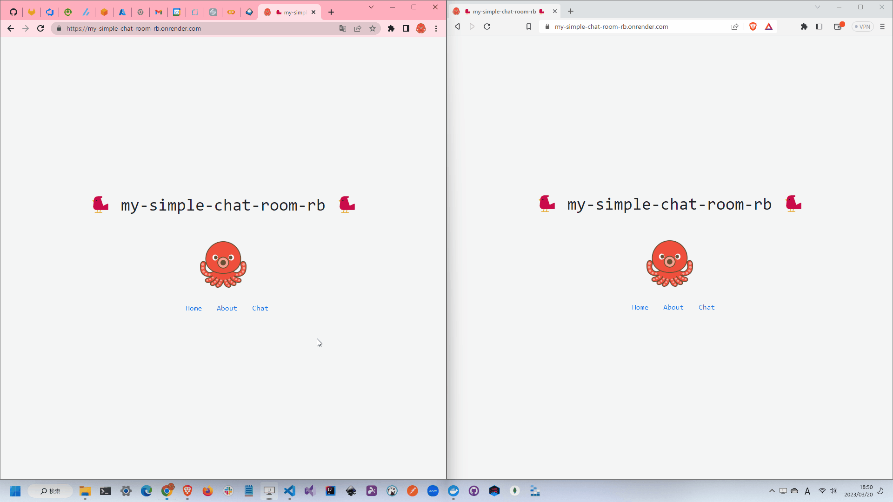

# my-simple-chat-room.rb

🐠🐠🐠 `Ruby on Rails` × `Next.js`で作成した簡単なチャットアプリです。  

  

## 実行方法

```shell
docker build -t my-simple-chat-room-rb .
docker run -it -p 8000:8000 --name my-simple-chat-room-rb my-simple-chat-room-rb
```

## 自分用メモ

転職先の企業でRuby(Rails)を使うことになったので、学習用に、、、  

```shell
gem install rails
rails new . --database=sqlite3 --api
```

### コントローラの作成

```shell
rails g controller コントローラ名 アクション名
```

### モデルの作成

```shell
rails g model モデル名 カラム名:データ型
rails db:migrate
```
